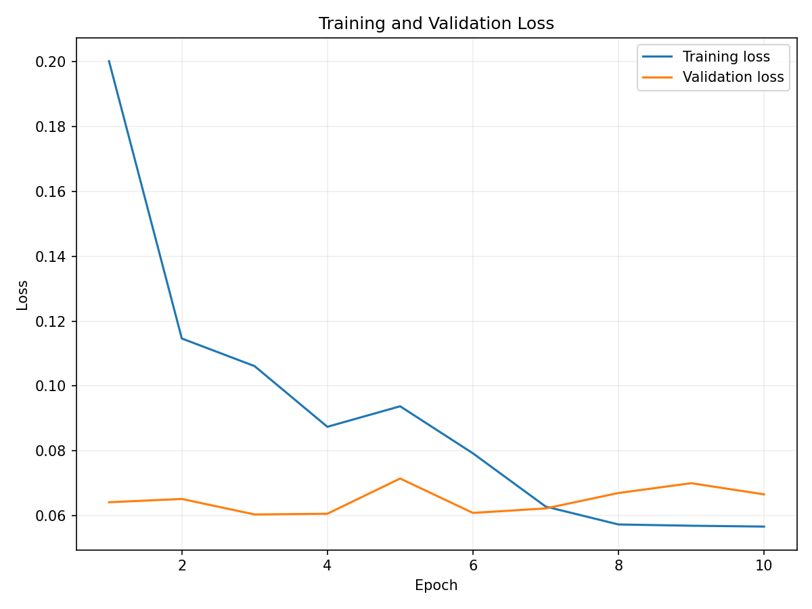

# Image Classifier: Cats vs Dogs 

## Project Overview
This project is an image classification system that distinguishes cats from dogs using a Convolutional Neural Network (CNN) with **Transfer Learning (MobileNetV2)**.  
It demonstrates the full machine learning pipeline: dataset preparation → data augmentation → CNN model → training → evaluation → saving model and results.

---

## Dataset
- Source: Kaggle Cats vs Dogs Dataset  
- Total images used: 4000  
  - 2000 Training  
  - 1000 Validation  
  - 1000 Testing  
- Purpose: Training set → model learning, Validation → tuning, Testing → final unbiased evaluation

---

## Data Pipeline
- Loaded images using `image_dataset_from_directory` in TensorFlow  
- Image size: 180x180 pixels  
- Batch size: 32  
- Verified labels to ensure correct image-category mapping  

### Data Augmentation
Applied to increase dataset diversity and prevent overfitting:  
- Random Flip → horizontal mirroring  
- Random Rotation → slight rotation  
- Random Zoom → zoom in randomly  

---

## CNN Model (From Scratch)
- **Conv2D Layers:** Extract image features (edges, shapes, textures)  
- **MaxPooling2D:** Reduce feature map size while keeping important information  
- **Flatten:** Convert 2D feature maps to 1D vector for Dense layers  
- **Dense Layers:** Fully connected layers to classify  
- **Activation Functions:**  
  - ReLU → hidden layers  
  - Softmax → output layer (Cat/Dog probabilities)

---

## Transfer Learning: MobileNetV2
- Pretrained on **ImageNet** dataset (1.2M images)  
- Used as a **feature extractor**; base weights frozen  
- Added custom top layers:  
  - Dense(128, ReLU) → learning task-specific features  
  - Dense(2, Softmax) → Cat vs Dog classification  
- Benefits: Higher accuracy, faster training

---

## Model Training
- Optimizer: Adam  
- Loss: Sparse Categorical Crossentropy  
- Epochs: 10  
- Observed improvements in training & validation accuracy

**Final Results:**  
- Training Accuracy: ~98%  
- Validation Accuracy: ~97%  
- Test Accuracy: ~97%

---

## Evaluation & Visualization

### Accuracy & Loss Curves
  
  

### Confusion Matrix
  

### Misclassified Examples
  

### Classification Report
